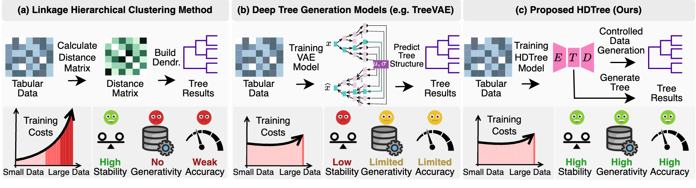
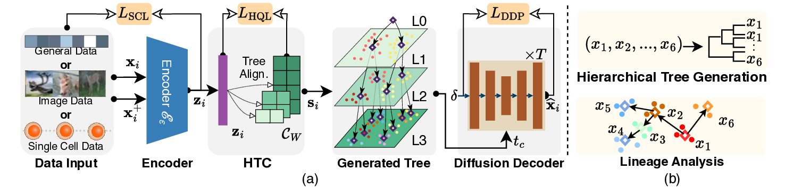
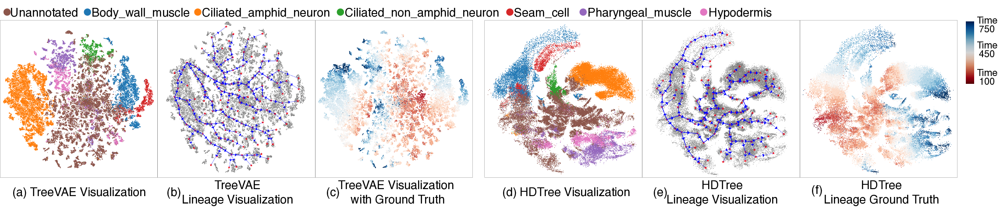

# HDTree：用 Diffusion Tree 建模细胞层次结构与发育轨迹

最近我们完成了一篇关于层次结构建模和细胞谱系推断的工作：**HDTree: Generative Modeling of Cellular Hierarchies for Robust Lineage Inference**。这项工作的核心问题是：当数据本身不是平面的类别划分，而是具有层次结构和连续转化关系时，模型应该如何同时学习 representation、tree structure 和 generative dynamics？

这个问题在单细胞研究中尤其明显。细胞分化不是简单地把每个细胞分到一个类别里，而是要理解细胞从 progenitor / stem cell state 到不同 differentiated cell types 的动态过程。换句话说，我们不只关心“这个细胞是什么类型”，还关心“这些类型之间如何连接”“分化路径是否合理”“模型能不能生成沿着这条路径变化的中间状态”。

HDTree 尝试把这些问题放到一个统一框架里：用一个共享的 hierarchical codebook 表示树状结构，用 diffusion process 建模沿着层次路径的连续转化，并用 learned hierarchy 做 lineage inference。



*图 1：HDTree 的问题动机。传统层次聚类缺少生成能力，branch-specific deep tree models 稳定性和扩展性受限；HDTree 用统一模型同时建模层次结构和生成过程。*

## 为什么普通 clustering 不够？

很多真实数据都有层次组织。图像类别可以有粗到细的语义结构，文本主题可以有父子主题，单细胞状态则经常对应发育、分化和命运选择过程。

传统方法通常把这个问题拆成几步：先做降维，再做 clustering，再用额外的树构建或 regression 方法去解释轨迹。这类方法可用，但会遇到几个问题：

- 树结构和 representation 往往不是端到端学习的；
- 在高维、大规模单细胞数据上计算成本较高；
- 很多方法只能给出结构，不能做生成式验证；
- 深层树结构容易不稳定，尤其是深层分支样本稀疏时。

近年来，VAE-based tree models 试图把生成和树结构结合起来，例如 TreeVAE 一类方法。但这类方法常常需要 branch-specific network modules，也就是不同分支有自己的网络模块。这样会带来两个问题：第一，树越深，模型结构越复杂；第二，深层稀疏分支难以共享其他分支学到的表示，容易过拟合或不稳定。

HDTree 的出发点是：能不能用一个统一的模型结构来表达深层 hierarchy，而不是为每个 branch 单独设计一套模块？

## HDTree 的核心想法

HDTree 的全称可以理解为 **Hierarchical Vector Quantized Diffusion Model**。它由三个核心部分组成：

1. **Encoder**：把输入样本映射到 latent representation；
2. **Hierarchical Tree Codebook, HTC**：用一个层次化的 vector-quantized codebook 表示树结构；
3. **Diffusion Decoder**：在给定层次路径条件下做 reconstruction / generation，用生成能力验证 learned hierarchy 是否合理。

这三个模块分别对应论文中的三个目标：学习语义表示、发现树状结构、验证沿着树路径的连续生成过程。



*图 2：HDTree 方法总览。模型由 encoder、Hierarchical Tree Codebook 和 diffusion decoder 组成，并基于 learned tree 进行 lineage analysis。*

### 1. 统一的 Hierarchical Tree Codebook

HDTree 不为每个分支单独设置 encoder-decoder，而是使用一个统一的 hierarchical codebook。每个 node 对应一个 learnable code vector，样本的 latent embedding 会从 root 开始逐层选择最接近的 child code，最终形成一条从 root 到 leaf 的 hierarchical code sequence。

这个设计有一个重要好处：树结构复杂度和神经网络参数规模被解耦了。即使树变深，模型也不需要为每个分支扩展出独立的网络模块。深层分支可以通过共享 codebook 和统一 encoder 继承全局表示，从而提高稳定性和泛化能力。

论文里也特别说明，codebook 内部使用 binary tree 作为高效索引结构，但这不意味着最终输出的 biological hierarchy 必须是严格二叉树。多个样本可以共享部分路径，在不同层级分叉；聚合到样本层面后，仍然可以形成多分支、不平衡的层次结构。

### 2. 用 Diffusion 建模连续分化过程

细胞分化更像一个逐步变化的过程，而不是一步从 latent code 跳到 observation。HDTree 因此引入 diffusion decoder：从噪声开始，逐步 denoise，并且每一步都 conditioned on hierarchical code sequence。

这个设计和 Waddington landscape 的直觉是对齐的：细胞状态从较粗的 progenitor state 逐渐进入更细的 specialized state。相比 VAE 的 single-step generation，diffusion 的 iterative denoising 更自然地表达了这种“逐步细化”的过程，也可以缓解 posterior collapse 一类问题。

在 HDTree 中，diffusion decoder 不只是为了生成好看的样本，而是作为一种 generative validation：如果模型沿着某条 lineage path 生成的数据不合理，那么这条 learned trajectory 的可信度也应该被质疑。

### 3. 从 learned tree 到 lineage inference

HDTree 学到 tree 后，会把这个 tree 转成一个 weighted graph。图中保留原始 tree edge，同时在同一层级上加入 KNN 辅助边，用来捕捉局部语义连接。随后，lineage inference 被转化为图上的 shortest-path problem：从指定的 origin node 到 destination node 找到代价最小的路径。

这里的关键是，KNN edge 只是增强局部连通性，并不改变全局 tree hierarchy。路径仍然被鼓励遵循 HDTree 学到的层次结构。

因此，HDTree 的 lineage analysis 不是在 embedding 上随便连线，而是在 learned hierarchical latent space 上做结构化路径推断。

## 训练目标：表示、量化和生成一起优化

HDTree 的 loss 由三部分组成：

- **SCL, Soft Contrastive Learning Loss**：保持局部语义邻域，并用 tree distance 调整 negative pairs；
- **HQL, Hierarchical Quantization Loss**：把 latent embedding 对齐到多层 code vectors，同时维护 parent-child consistency；
- **DDP, Diffusion Loss**：训练 diffusion decoder 在 hierarchical path 条件下做 denoising / reconstruction。

简单说，SCL 负责让表示空间有局部语义结构，HQL 负责让这个表示空间形成稳定的树状 codebook，DDP 则负责检验和强化这个 tree-conditioned latent path 是否能支持生成。

论文的 ablation 也支持这个设计：在 MNIST 和 ECL 上，完整 HDTree 都取得最好结果；去掉 HTC、SCL 或 HQL 都会导致 tree metrics 和 clustering metrics 明显下降。其中去掉 HTC 的影响尤其大，说明 hierarchical codebook 是模型结构中的关键部分。

## 实验：从通用数据到单细胞谱系

论文从几个角度评估 HDTree：

- general datasets：MNIST、Fashion-MNIST、20News-Groups、CIFAR-10；
- single-cell datasets：Limb、LHCO、Weinreb、ECL；
- lineage ground truth：LineageVAE dataset 和 C. elegans；
- generative validation：沿着 tree path 生成样本；
- computational cost 和 ablation。

评价指标也分成三类：

- clustering performance：ACC、NMI；
- tree structure performance：DP、LP；
- reconstruction performance：reconstruction loss 和 log-likelihood。

这种评估方式比较重要，因为 HDTree 不是单纯的 clustering 方法。如果只看 ACC，会忽略它是否学到了合理 tree；如果只看 tree purity，又会忽略 embedding 和 reconstruction 是否稳定。因此论文同时报告 clustering、tree structure 和 reconstruction。

## 在通用数据上的结果

在 MNIST、Fashion-MNIST、20News-Groups 和 CIFAR-10 上，HDTree 相比 Agglomerative Clustering、VAE、LadderVAE、DeepECT、TreeVAE 等方法，在 tree metrics、clustering metrics 和 reconstruction metrics 上整体更强。

几个代表性结果：

- MNIST 上，HDTree 达到 DP 91.9、LP 96.6、ACC 96.6、NMI 92.4，同时 reconstruction loss 和 log-likelihood 也优于 TreeVAE；
- Fashion-MNIST 上，HDTree 的 ACC 提升到 71.1，高于 TreeVAE 的 60.6；
- 20News-Groups 上，HDTree 的 DP / ACC / NMI 都明显高于 TreeVAE；
- CIFAR-10 上，HDTree 在复杂图像数据上仍然保持更强的 clustering 和 tree structure performance。

这些结果说明，HDTree 的优势并不局限于单细胞数据。它本质上是一个通用的 hierarchical representation learning 和 generative modeling framework。

## 在单细胞数据上的结果

单细胞数据是 HDTree 更主要的应用场景。论文评估了 Limb、LHCO 和 Weinreb 三个 single-cell datasets，并与 TreeVAE、Geneformer、CellPLM、LangCell 等方法比较。

这里有一个需要注意的设置差异：Geneformer、CellPLM、LangCell 在表中主要是 zero-shot representation + agglomerative clustering，而 HDTree 是在目标数据上 unsupervised training。两者并不是完全相同的设定。但这个比较仍然有意义：它展示了 HDTree 不依赖大规模预训练模型，也可以在目标数据上高效学习细粒度层次结构。

在 Limb 数据上，HDTree 取得：

```text
DP   41.0
LP   57.2
ACC  55.0
NMI  46.6
Average 50.0
```

相比 TreeVAE 的 average 47.5，HDTree 有稳定提升。

在 LHCO 上，HDTree 的 average 达到 45.2，高于 TreeVAE 的 40.0；在 Weinreb 上，HDTree 和 HDTree-A 都明显优于 TreeVAE，其中 HDTree-A 的 average 达到 59.3。

总体上，HDTree 在单细胞数据上更稳定地提升了 tree performance 和 clustering performance，尤其是在复杂或大规模 lineage 数据中更明显。

## Lineage ground truth：学到的路径是否符合发育时间？

只看 clustering 和 tree purity 还不够。对于 lineage inference，关键问题是：模型学到的路径是否真的和发育进程一致？

论文使用 observed time points in k-neighborhood 来评价 latent representation 是否和 developmental progression 对齐。在 LineageVAE dataset 上，HDTree 在 Day 2、Day 4、Day 6 都取得最高或最优水平：

```text
Day 2: 23.2%
Day 4: 38.4%
Day 6: 62.0%
```

在 C. elegans 数据上，HDTree 在 300--500 和 500--750 时间窗口中分别达到 45.8% 和 66.3%，相比 TreeVAE 有超过 4 个百分点的提升。

这个结果说明，HDTree 学到的 hierarchy 不只是数学上更纯，也更符合真实发育时间结构。



*图 3：C. elegans case study。相比 TreeVAE，HDTree 推断出的 lineage visualization 更接近真实发育时间结构。*

## Generative validation：沿着谱系路径生成

HDTree 的另一个特点是可以做 tree-conditioned generation。论文中展示了两个例子：

- 在 MNIST 上，从 digit 6 沿着 learned path 生成到 3、1、9；
- 在 C. elegans 上，从 stem cell 到 somatic cell，生成结果中的 marker genes 呈现出一致变化趋势。

这部分实验的重点不是“生成图片/细胞表达好不好看”，而是验证 learned lineage path 是否对应合理的数据流形变化。也就是说，generation 在这里是一种科学验证工具：如果沿着 tree path 生成的中间状态连续且合理，说明 learned hierarchy 更可信。

## 效率与局限

训练时间方面，HDTree 在小数据上不一定比 UMAP + Agg 这类传统方法更快，但在大规模数据上表现更稳。例如 Weinreb 上，HDTree 的训练时间为 53:47，明显低于 TreeVAE 的 361:12。

当然，HDTree 也有局限。由于使用 diffusion decoder，采样和生成推理天然比 VAE 更慢。这是一个明确的 trade-off：HDTree 用更高成本的 iterative denoising 换取更稳定的 hierarchy modeling 和更高保真的 generative validation。后续可以考虑 fast sampling、distillation 或 latent diffusion 来加速。

## 总结

HDTree 的核心贡献可以概括为三点：

1. **方法上**：提出统一的 hierarchical vector-quantized diffusion framework，用共享 codebook 替代 branch-specific modules，降低深层树结构建模的不稳定性；
2. **任务上**：把 hierarchical representation learning、lineage inference 和 generative validation 放在同一框架中；
3. **实验上**：在通用数据、单细胞数据和 lineage ground truth 上，系统验证了 HDTree 在 tree structure、clustering、reconstruction 和 developmental alignment 上的优势。

我个人认为这项工作的关键不是“又做了一个聚类模型”，而是把层次结构发现和生成式验证结合起来：模型不仅要给出树，还要能沿着树生成合理的状态变化。对于单细胞谱系、发育轨迹和其他具有层次结构的数据，这种范式可能会很有用。

论文代码和最小复现版也已经整理出来。当前公开版主要支持 MNIST 和 Limb 两个数据的复现，其他论文数据和 lineage case studies 暂时不包含在 minimal release 中：

- Project homepage: https://zangzelin.github.io/code_HDTree_icml/
- GitHub code: https://github.com/zangzelin/code_HDTree_icml
- Hugging Face checkpoints: https://huggingface.co/zelinzang/HDTree-ICML-checkpoints
